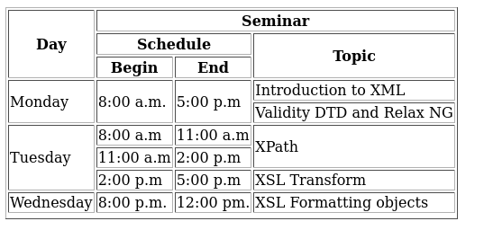

# Seminar table

A simple table build with HTML5

### Screenshot

### Links

- Code File URL: [github.com](https://github.com/Jyotimoykathar/assignment10html)
- Live Site URL: [netlify.app](https://assignment10html.netlify.app/)

### Useful resources

- [w3schools](https://www.w3schools.com/html/html_tables.asp) - This website helped with colspan and rowspan.

## Author

- Github page- [Jyotimoykathar](https://github.com/Jyotimoykathar/)
